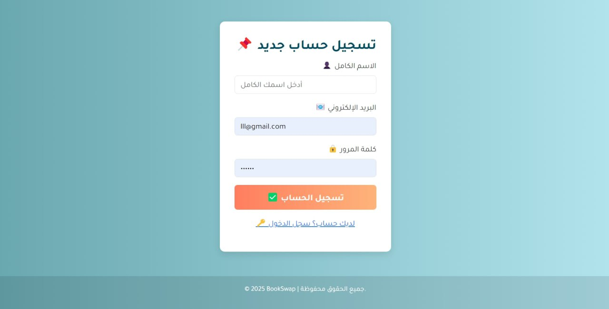
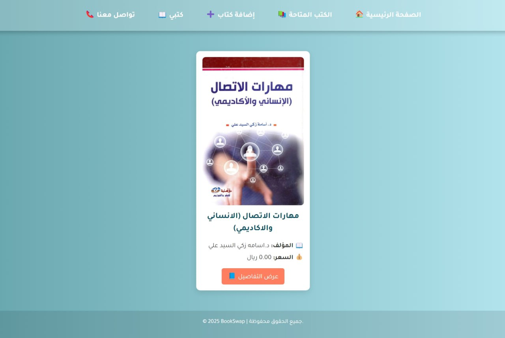
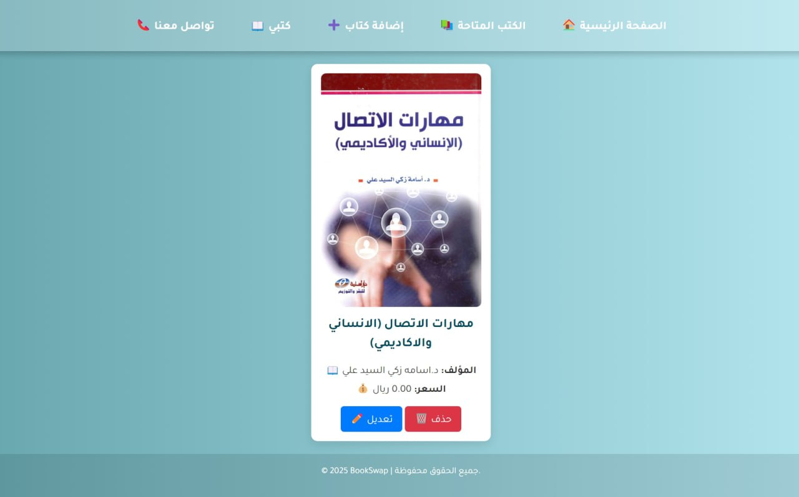

# 📚 BookSwap — University Book Exchange Platform  
منصة BookSwap — منصة تبادل الكتب الجامعية

BookSwap is a modern platform built with C# (ASP.NET Web Forms) and SQL Server, designed to help university students exchange, sell, and browse books easily within their college community.  
تم بناء منصة BookSwap باستخدام C# (ASP.NET Web Forms) وقاعدة بيانات SQL Server، بهدف تسهيل تبادل وبيع واستعراض الكتب بين طلاب الجامعات بطريقة سهلة ومنظمة.

---

## 🖼️ Photo  
صور المشروع
Create Account — تسجيل حساب جديد
  

Login — تسجيل الدخول
 

Home Page — الصفحة الرئيسية
  

Available Books — الكتب المتاحة
  

Book Details — تفاصيل الكتاب
  

Add New Book — إضافة كتاب
  

Edit or Delete — تعديل أو حذف كتاب
  

Contact Us — تواصل معنا
  

---

## ✨ Project Overview  
نظرة عامة على المشروع

BookSwap offers a full ecosystem for students to publish, manage, and explore books based on their major and university, with a clean Arabic RTL interface and secure authentication.  
يوفّر BookSwap بيئة متكاملة للطلاب لنشر الكتب وإدارتها واستعراضها حسب التخصص والجامعة، مع واجهة عربية مرتّبة ونظام تسجيل دخول آمن.

It solves a real challenge students face: finding affordable and relevant textbooks in their local academic community.  
ويحل مشكلة حقيقية يعاني منها الطلاب: صعوبة إيجاد كتب مناسبة وبأسعار معقولة داخل مجتمعهم الجامعي.

---

## 🛠️ Technologies Used  
التقنيات المستخدمة

C# (ASP.NET Web Forms)  
Used to build system logic, authentication, page interactions, and all backend operations.  
تُستخدم لبناء منطق النظام ومعالجة الصفحات والتسجيل والدخول وجميع العمليات الخلفية.

SQL Server  
Stores books, users, images, and all system data with full CRUD operations.  
يُستخدم لتخزين بيانات الكتب والمستخدمين والصور وجميع بيانات النظام مع دعم كامل لعمليات CRUD.

ADO.NET  
Handles database connectivity and command execution.  
يُستخدم لربط النظام بقاعدة البيانات وتنفيذ الاستعلامات.

Visual Studio  
Main development environment for building, debugging, and managing the system.  
بيئة التطوير الأساسية لبناء وتشغيل وإدارة المشروع.

---

## 🌟 Key Features  
أهم المميزات

User Registration & Login  
Secure authentication system for student accounts.  
نظام تسجيل دخول آمن يدعم إنشاء الحسابات للطلاب.

Add, Edit, Delete Books  
Full CRUD system with image upload.  
نظام CRUD متكامل مع دعم رفع صور الكتب.

Browse Books by Major & University  
Smart filtering tailored for academic contexts.  
فلترة ذكية حسب التخصص والجامعة.

Clean Arabic RTL Interface  
Designed for clarity, comfort, and accessibility.  
واجهة عربية RTL واضحة وسهلة الاستخدام.

Book Details Page  
Shows all information with contact and action options.  
قسم تفاصيل يعرض جميع بيانات الكتاب مع خيارات تواصل وإجراءات.

Contact Support  
Built-in contact form for assistance.  
نموذج تواصل مدمج للدعم والاستفسارات.

---

## 🎯 What This Project Demonstrates  
ماذا يثبت هذا المشروع؟

Strong C# and SQL Server skills  
قدرة عالية على البرمجة بلغة C# والربط مع قواعد بيانات SQL Server.

Building complete real systems (CRUD + Authentication)  
القدرة على بناء أنظمة حقيقية كاملة تشمل CRUD وتسجيل دخول.

Professional database design and integration  
تصميم وربط قواعد بيانات بطريقة احترافية.

Arabic RTL interface development  
احتراف في تصميم واجهات عربية متكاملة RTL.

Real problem-solving for university communities  
حل مشكلة واقعية تواجه الطلاب وتقديم منصة تخدم احتياجاتهم.

---

## 👩‍💻 Developer  
المطورة

Teef M. Karyry — TeefDev 
